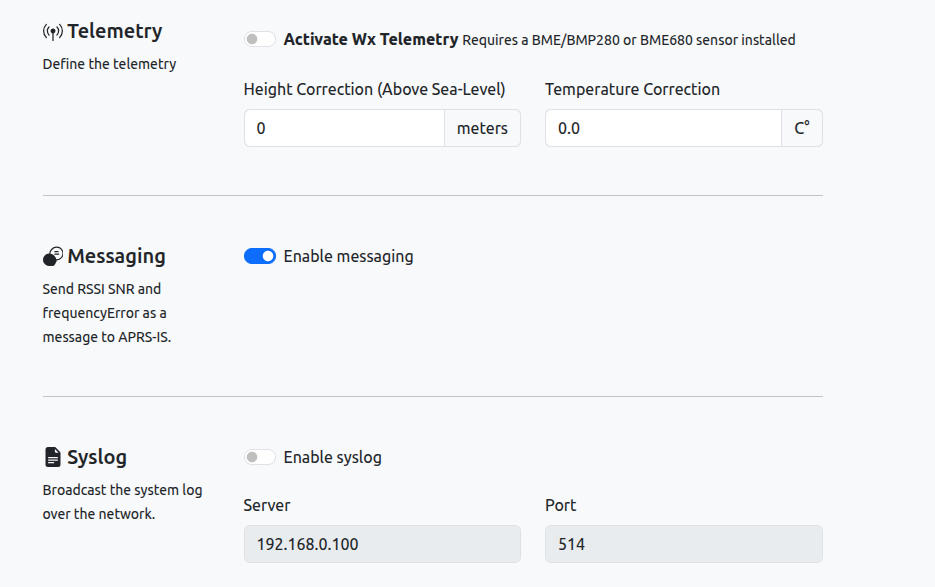
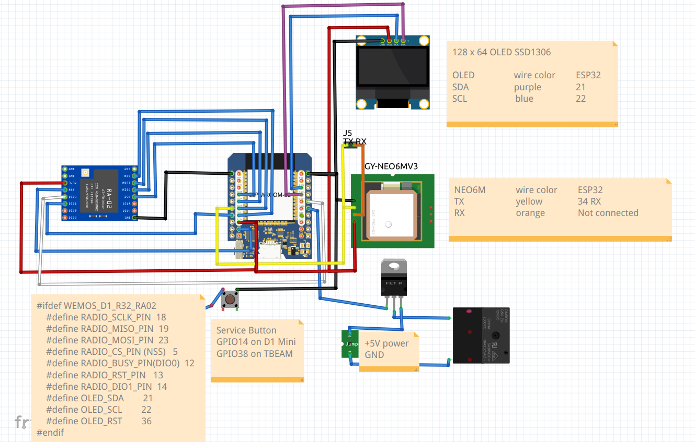

# IW5ALZ LoRa APRS iGate/Digirepeater

## OVERVIEW

This firmware is copied from https://github.com/richonguzman/LoRa_APRS_iGate.

I changed a few things to adapt it to my needs

To have it working with the schematic below, select the platformio environment [env:WEMOS-D1-R32-RA02]

## CHANGES

### RSSI MESSAGES

I added the configurable option to send an APRS message to APRS-IS containing the RSSI, SNR and ErrorFreq of any RF received packet.
In the message section of aprs.fi you'll see something like this:

2025-09-20 19:30:42 CEST: IW5ALZ-7>IW5ALZ-11: RSSI -82 SNR 9.00 FreqErr -13430

It means that this iGate (IW5ALZ-11) received an RF APRS packet from IW5ALZ-7 with RSSI=-82dBm SNR=9dB and with a frequency error of 13430

Please note that this option can be enabled by the web configurator:

## SCHEMATIC

